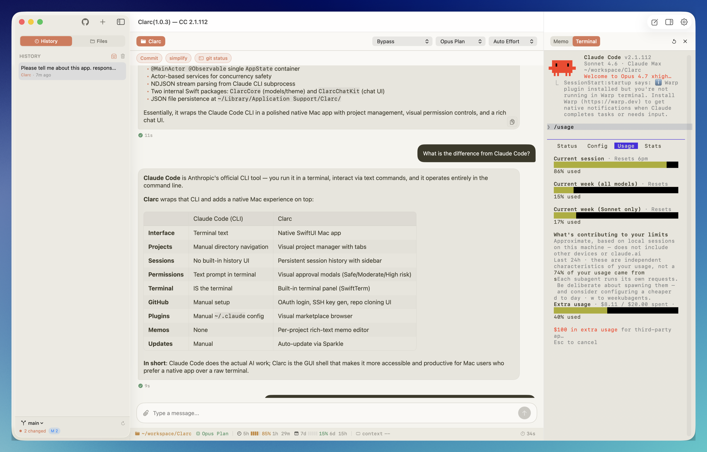

# Clarc

**Native macOS desktop client for Claude Code**

Escape the terminal-based CLI and leverage all Claude Code features through an intuitive GUI.

---

## Screenshots

---

## Features

| Feature | Description |
|---------|-------------|
| **Streaming Chat** | Real-time streaming conversation with Claude Code. Markdown rendering, tool call visualization |
| **Multi-Project** | Register multiple projects and switch freely. Per-project session history |
| **Dedicated Windows** | Double-click a project tab to open it in its own independent window |
| **GitHub Integration** | OAuth authentication, SSH key management, repository browsing and cloning |
| **File Attachments** | Drag-and-drop image/file attachments. Auto-conversion of long text to attachments |
| **Slash Commands** | Extensible command system with custom per-project commands |
| **Shortcut Buttons** | Configurable quick-access buttons for frequently used messages or terminal commands |
| **Permission Management** | Risk-based approve/deny UI before tool execution |
| **Skill Marketplace** | Browse and install official Anthropic plugins |
| **Model Selection** | Choose between claude-opus-4-6, claude-sonnet-4-6, and claude-haiku-4-5 |
| **Usage Tracking** | Per-session token count, cost, and duration |
| **Built-in Terminal** | SwiftTerm-based terminal emulator |
| **File Explorer** | Project file tree, Git status, file preview |
| **Memo Panel** | Per-project rich-text memo pad in the sidebar inspector |
| **User Guide** | Built-in help guide accessible from the toolbar |
| **Auto-update** | Sparkle-based automatic update checking |

---

## Requirements

- **macOS 15.0** or later
- **[Claude Code CLI](https://docs.anthropic.com/en/docs/claude-code)** must be installed
- **Xcode 16** or later (for building)

---

## Installation

1. Download the latest `Clarc-x.y.z.zip` from the [Releases](https://github.com/ttnear/Clarc/releases) page.
2. Unzip and move `Clarc.app` to your `Applications` folder.
3. Launch `Clarc.app`.

### First Launch on macOS 15 (Sequoia)

macOS Sequoia blocks the first launch of any downloaded app — even notarized ones — and routes approval through System Settings instead of the old right-click → Open flow.

When you see **"Apple could not verify 'Clarc.app' is free of malware..."**:

1. Click **Done** on the dialog.
2. Open **System Settings → Privacy & Security**.
3. Scroll to the Security section and click **Open Anyway** next to `Clarc.app`.
4. Confirm with your password or Touch ID.

After this one-time approval, Clarc launches normally. The app is signed with a Developer ID certificate and notarized by Apple — this prompt is standard macOS behavior, not a security warning specific to Clarc.

---

## License

Apache License 2.0 — see the [LICENSE](LICENSE) file for details.
